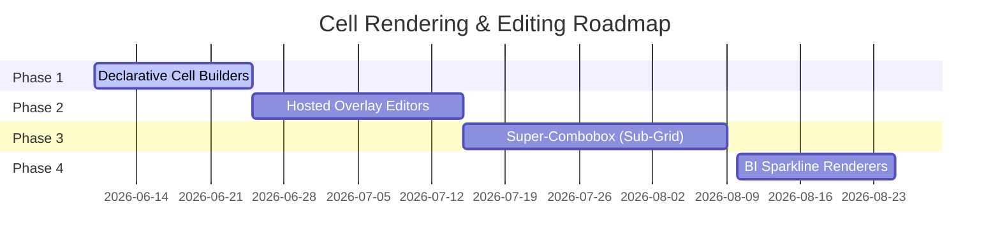

# Cell Rendering and Cell Editing Research

This document presents a comprehensive research study and architectural proposal for **Cell Rendering** and **Cell Editing** systems within the `FxListBox` and `FxGrid` components of the `FxDesktop` package. 

We analyze existing paradigms in modern JavaScript UI frameworks, .NET WinForms, and Delphi VCL to design a high-performance, developer-friendly, and generator-compatible architecture tailored for Flutter.

---

## 1. Executive Summary

Desktop business applications operate on dense, structured datasets. Cells are no longer simple read-only text fields; they require rich, context-aware visualizations (renderers) and intuitive, keyboard-accessible input mechanisms (editors).

To achieve parity with enterprise desktop platforms, `FxDesktop` must decouple **data representation** from **data manipulation**. 

Our proposed architecture introduces:
1. **Declarative Cell Builders**: A Flutter-native, reactive rendering approach with built-in standard renderers (checks, badges, sparklines).
2. **Hosted Cell Editors & Overlay Popups**: A transient editing container that overlays the cell, handling validation, focus retention, and external popup coordinates (e.g., custom dropdowns, calendars, and calculators).
3. **A Serialization Contract**: Formalized metadata models enabling AI agents and Xojo generators to define rendering formats and editor properties declaratively.

---

## 2. Analysis of Existing Platforms

To design the ideal system for Flutter, we analyze the historical and modern approaches taken by three major GUI platforms.

### 2.1 JavaScript UI Grids (ag-Grid, Handsontable, DevExtreme)

Modern enterprise JS grids are the gold standard for web-based BI and desktop-in-browser applications.

*   **Architectural Model**: Component Delegation.
    *   **Cell Renderer**: A persistent component representing the cell. It receives a `params` object containing the cell value, row data, grid API, and node status. It is reactively rebuilt when cell data updates.
    *   **Cell Editor**: A transient component instantiated only when editing begins (e.g., double-click, keyboard edit trigger) and destroyed upon commit or cancel. Editors communicate results back to the grid via a strict interface (typically implementing `getValue()`).
*   **Popup Mechanics**: JS grids use absolute CSS positioning and portal/body appending to render complex editors (like date pickers or dropdowns) outside the grid's viewport, avoiding overflow clipping.
*   **Pros**: Complete separation of concerns, easy to plug in custom framework components, highly flexible.
*   **Cons**: Large memory overhead if thousands of complex cell components are mounted simultaneously (solved in ag-Grid via aggressive DOM virtualization).

### 2.2 .NET WinForms (DataGridView)

WinForms represents the classic desktop design system, built on heavy OS handles (`HWND`).

*   **Architectural Model**: Hosted Control Pattern.
    *   Since allocating a separate WinForms control (`TextBox`, `ComboBox`) for every single table cell would exhaust Windows system resources and degrade scroll performance, the `DataGridViewCell` is a lightweight object that only draws itself using GDI+ painting.
    *   When editing begins, the grid dynamically **hosts** a single, persistent editing control (e.g., `DataGridViewTextBoxEditingControl` which implements `IDataGridViewEditingControl`).
    *   This hosted control is placed as a child of the grid, resized to match the cell boundaries, focused, and populated with the cell's initial value. Upon commit, the value is written back to the cell model, and the hosted control is hidden.
*   **Pros**: Extremely high performance, low memory footprint, and reliable OS-level focus management.
*   **Cons**: High complexity when creating custom column cells; requires implementing three separate classes: `DataGridViewColumn`, `DataGridViewCell`, and the `IDataGridViewEditingControl`.

### 2.3 Delphi VCL (TDBGrid & TStringGrid)

Delphi is renowned for its rapid application development (RAD) database grids, which pioneered efficient database editing.

*   **Architectural Model**: Subclassed In-place Editors (`TInplaceEdit`).
    *   Similar to WinForms, `TDBGrid` maintains a single internal edit control (`InplaceEditor` of type `TInplaceEdit`, which descends from `TCustomMaskEdit`).
    *   The grid handles drawing cell values onto its window canvas during paint loops. When editing is activated, the single `InplaceEditor` is moved and focused.
    *   For richer controls (like picklists or ellipsis button dialogs), the grid changes the `ButtonStyle` of the column. Clicking the button fires events like `OnEditButtonClick` to open modal dialog forms.
*   **Pros**: Lightweight, deeply integrated with dataset fields (`TField`), and highly responsive keyboard handling.
*   **Cons**: Customizing the inline editor control requires low-level subclassing of the grid and overriding `CreateEditor`, which is notoriously difficult for junior developers.

---

## 3. Comparison of Architectural Paradigms

| Feature | JS Grid (Component Delegation) | .NET WinForms (Hosted Control) | Delphi VCL (In-place Canvas Edit) | FxDesktop (Proposed Builder & Overlay) |
| :--- | :--- | :--- | :--- | :--- |
| **Rendering Tech** | HTML DOM Elements | GDI+ Canvas Painting | GDI Canvas Painting | Flutter Widget Tree & Canvas |
| **Cell Creation** | Virtualized Component lifecycle | Lightweight cell class | Structural columns & drawing | Virtualized reactive Widgets |
| **Editor Allocation** | Created/destroyed on demand | Single reused control per grid | Single internal control | Dynamically swapped widget / Overlay |
| **Popup Support** | Body portal absolute positioning | Hosted drop-down windows | Ellipsis button dialogs | Flutter `Overlay` & `ComposedComponent` |
| **Parity Rating** | Flex: 10/10, Speed: 7/10 | Flex: 6/10, Speed: 9/10 | Flex: 5/10, Speed: 9/10 | Flex: 9/10, Speed: 9/10 |

---

## 4. Proposed Architecture for FxDesktop

We propose a **declarative builder pattern** for cell rendering and a **dynamically hosted portal pattern** for cell editing. This combines the flexibility of modern JS component structures with the performance and encapsulation of native desktop frameworks.

```
+-------------------------------------------------------------+
|                        FxListBox/FxGrid                     |
|                                                             |
|   +------------------+                    +-------------+   |
|   |   Cell Renderer  |                    | Cell Editor |   |
|   |   (Read-Only)    |                    |  (Active)   |   |
|   |                  |                    |             |   |
|   |   Custom Paints, |                    | Swaps over  |   |
|   |   Badges, Bars   |                    | Cell widget |   |
|   +--------+---------+                    +------+------+   |
+------------|-------------------------------------|----------+
             | (Double-click / Enter)              | (Esc / Blur)
             v                                     v
+------------+-------------------------------------+----------+
|                  Flutter Overlay (Floating Portal)          |
|                                                             |
|   Rendered above table scroll bounds (e.g. Dropdowns,      |
|   Calculators, Date Pickers, Super-combobox grids)          |
+-------------------------------------------------------------+
```

### 4.1 Visual Layer: Declarative Cell Builders

Each column descriptor (`FxListBoxColumn` / `FxGridColumn`) will support custom builders:

```dart
typedef FxCellRendererBuilder = Widget Function(
  BuildContext context,
  String rowId,
  String columnId,
  Object? value,
  bool isSelected,
  bool isHovered,
);
```

By default, the table checks if `cellRenderer` is supplied. If not, it falls back to standard built-in renderers:
*   **TextRenderer**: Deals with string truncation, alignment, and formatting (e.g. currency, decimal alignment).
*   **BooleanRenderer**: Renders checked/unchecked/indeterminate states (checkboxes).
*   **ProgressRenderer**: Renders bar overlays for percentage data.
*   **SparklineRenderer**: Renders an array of numbers as a Canvas-drawn trend line.

### 4.2 Interaction Layer: Hosted Inline Editors & Overlay Popups

When a cell enters edit mode:
1.  The cell's visual builder is replaced with the `FxCellEditorBuilder` in the grid widget tree.
2.  If the editor requires popup space (e.g. Combobox dropdown, Date Picker, Calculator), it registers with an **FxTableOverlayManager** using a `LayerLink`.
3.  The overlay is pushed onto Flutter's global `Overlay` stack. This ensures the popup remains visible even if it extends beyond the boundary of the table or scroll viewport.
4.  Focus is requested on the editor's primary input widget.

### 4.3 Unified Metadata Contract (Xojo / AI Generator Friendly)

To allow generators to design grids without writing Dart code, columns can define their rendering and editing styles via serializable descriptors:

```json
{
  "id": "notes",
  "caption": "Doctor Notes",
  "renderer": {
    "type": "text",
    "lineWrap": true
  },
  "editor": {
    "type": "super_combobox",
    "dataSource": "patients_lookup_api",
    "displayColumn": "name",
    "searchable": true
  }
}
```

---

## 5. Feature Copy List

We recommend copying the following battle-tested features from existing platforms to compile our future roadmap.

### 5.1 Cell Renderers (View Options)

1.  **Formatters (WinForms / Delphi)**: Support format strings like `C` (Currency), `P` (Percentage), `N2` (Number with 2 decimal places), and date format masks.
2.  **Sparkline Charts (JS Grids)**: Draw micro line-charts, bar-charts, or area trend indicators inside cells directly from list values (e.g. `[12, 5, 23, 18, 9]`).
3.  **Visual Badges & Status Pills (Modern JS)**: Render text wrapped in styled status pills (e.g. red pill for "Critical", green pill for "Healthy") based on value maps.
4.  **Conditional Background Blenders (Delphi/VCL)**: Ability to color cells based on custom data evaluations, dynamically blended with selection/hover overlays.

### 5.2 Cell Editors (Input Options)

1.  **Ellipsis Dialog Trigger (Delphi ButtonStyle)**: An inline button rendered next to the cell text. Clicking it opens a custom modal form, bypassing standard inline input limits.
2.  **Popup Calculator (Xojo/VCL Pattern)**: A numeric input that opens a small mathematical calculator popup directly beneath the cell.
3.  **Super-Combobox (Business ERP Pattern)**: A combobox dropdown that doesn't just show a list of strings, but opens a **fully virtualized, mini-grid** showing secondary records (e.g., selecting a customer shows customer ID, company name, and balance in a sub-table dropdown).
4.  **Timepicker / Calendar Slider**: Quick touch-and-drag slider components that snap to hours/minutes or numeric bounds inside the cell.

---

## 6. Technical Challenges in Flutter & Solutions

Implementing these desktop-grade paradigms in Flutter introduces specific engine-level and widget-tree difficulties.

### 6.1 Keyboard Navigation & Focus Interception
*   **The Problem**: Swapping a read-only widget for an editor destroys the old widget and builds a new one. This breaks the active `FocusNode` chain, often causing focus to fall back to the root `FocusScopeNode` and causing key event handlers to miss keys.
*   **The Solution**: The grid state should maintain a stable `_editingFocusNode`. The editor widget receives this node, preventing focus resets. Furthermore, key events (such as Arrow Keys and Enter) must be intercepted at the grid level using `Focus.onKeyEvent` before they propagate to the editor, allowing the grid to decide whether to move focus to the next cell or let the editor consume the keystroke.

### 6.2 Overlay Anchor Positioning & Viewport Clipping
*   **The Problem**: Flutter wraps scrollable regions in `ClipRect` widgets. If an editor widget opens a dropdown or a sub-panel, the scroll viewport will clip any pixels that extend past its boundaries.
*   **The Solution**: We must use Flutter's `Overlay` class. We bind a `ComposedComponent` or `Portal` structure using `CompositedTransformTarget` on the cell, and `CompositedTransformFollower` on the overlay. This matches the overlay's coordinates to the scrolling cell dynamically.
*   **Scroll Sync**: We listen to table scroll notifications and automatically dismiss popups or translate their positions relative to the screen.

### 6.3 Virtualization & Cell Recycling Conflicts
*   **The Problem**: `two_dimensional_scrollables` virtualizes cells, meaning widgets are reused as the user scrolls. If the user is editing cell `(row: 5, col: 2)` and scrolls down rapidly, cell `(5, 2)` may be recycled to draw cell `(50, 2)`. If the editor isn't disposed of immediately, the text input widget will appear on row 50 containing row 5's data.
*   **The Solution**: Trigger `onCellEditCancel` or `onCellEditCommit` automatically when the active edit cell's row index falls outside the visible viewport range. 

### 6.4 BI/Sparkline Render Performance
*   **The Problem**: Sparklines and charts require canvas drawing operations. Redrawing dozens of sparklines on every scroll frame will cause garbage collection spikes and drop frame rates below 60fps.
*   **The Solution**: Use `RepaintBoundary` on sparkline cells to cache their pixel representations. The sparkline will only repaint if its underlying list values change, keeping scrolling light and hardware-accelerated.

---

## 7. Long-Range Implementation Roadmap

We propose structuring the implementation of these features over four release stages.



### Phase 1: Declarative Column Builders
*   Deliver `cellRenderer` and `cellEditor` signature contracts.
*   Implement `didUpdateWidget` synchronization for dynamic overrides.
*   Create built-in formatters (Currency, Date, Boolean status pills).
*   Add unit tests verifying widget swap performance.

### Phase 2: Hosted Overlay Editors (Calculator & Calendar)
*   Deliver `FxTableOverlayManager` utilizing `CompositedTransformFollower`.
*   Implement a numeric editor with an attached calculator dropdown overlay.
*   Implement a date-time cell editor with a mini calendar dropdown.
*   Verify overlay dismissal on table scroll events.

### Phase 3: Super-Combobox (Sub-Grid dropdown)
*   Build a lookup cell editor that fetches data asynchronously.
*   Implement a dropdown panel that renders a virtualized, read-only `FxGrid` as its selection list.
*   Implement keyword search/filtering inside the dropdown sub-grid.

### Phase 4: BI Sparkline Renderers
*   Create a custom painter class for lightweight inline line and bar charts.
*   Integrate `RepaintBoundary` caching to maintain 120fps scrolling.
*   Demonstrate real-time dataset charts on Page 9 of the demo spec gallery.
